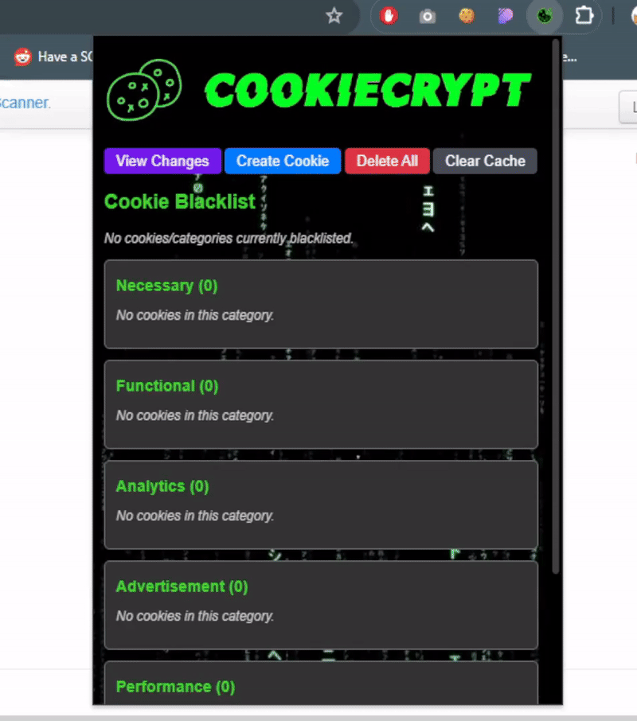
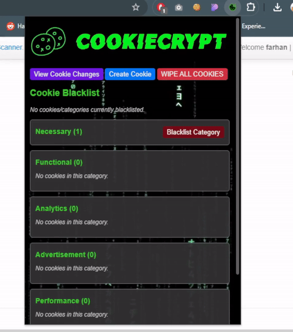
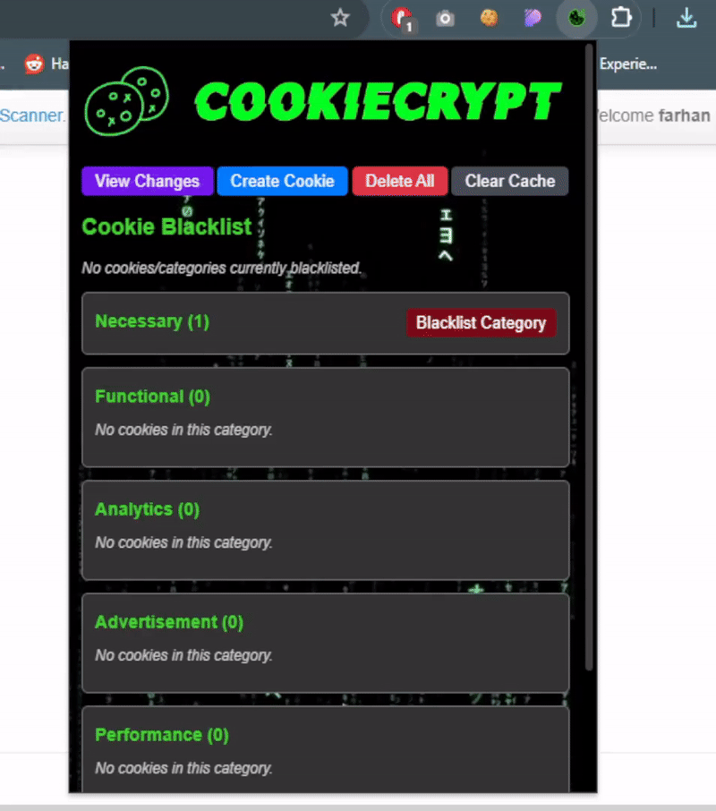
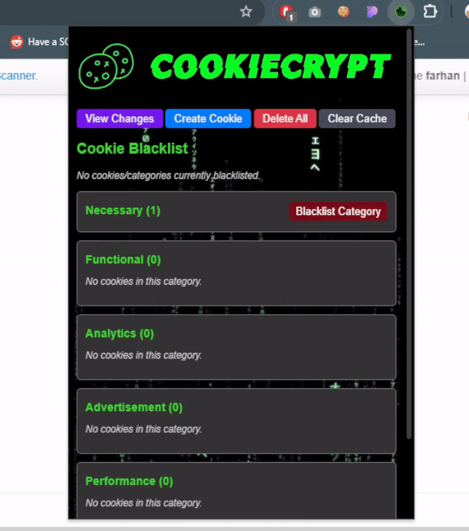
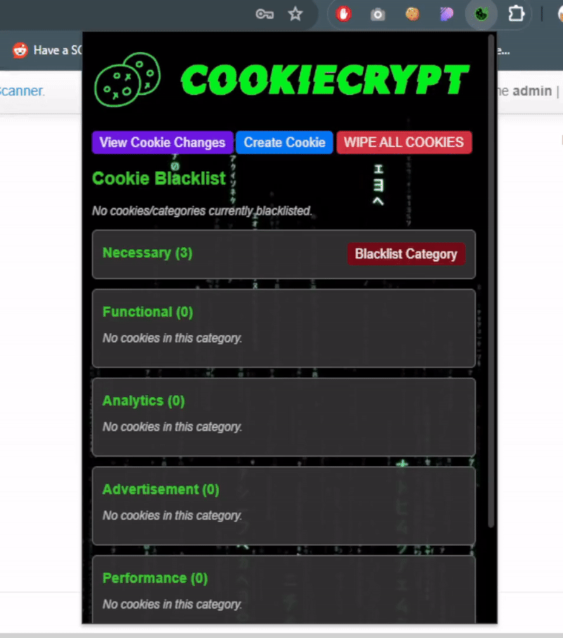

## Overview
CookieCrypt is an innovative browser extension designed to empower users with advanced cookie management. It offers a trio of key features: <b>Cookie Inventory Categorization, Real-Time Cookie Monitoring & Alerts, and Cookie Permission Management</b>. These functionalities enhance user understanding, provide greater control over privacy, and align with stringent data protection regulations. Behind its user-centric interface, CookieCrypt leverages a robust backend hosted on an <b>Azure Cloud VM</b>, utilizing <b>Flask</b> for a streamlined API endpoint. This backend is the powerhouse for processing cookies, employing multiple machine learning algorithms to ensure accuracy and efficiency in categorization. The use of Azure Cloud VM ensures scalability and reliability, allowing CookieCrypt to handle vast amounts of data seamlessly while providing the machine learning backbone necessary for its features.

<p align="center">
  
</p>

## Key Features

### 1. Cookie Inventory Categorization
Utilizing machine learning algorithms, CookieCrypt automatically categorizes cookies into groups such as Necessary, Analytics, Functional, Others, and Advertisement. This categorization enriches user comprehension of cookies, promotes informed decision-making, and maintains alignment with GDPR for transparent communication about cookie usage.

#### Benefits:
- **Enhanced Understanding**: Provides an organized view of cookies, facilitating user education about their purpose.
- **Informed Decisions**: Empowers users with the knowledge to manage their privacy preferences effectively.
- **Regulatory Compliance**: Ensures that users are informed about cookie functions, in line with GDPR requirements.

### 2. Real-Time Cookie Monitoring & Alerts
CookieCrypt monitors cookies in real-time and alerts users about new cookie activity. This instant notification system heightens user awareness regarding site tracking and data collection practices, crucial for modern digital navigation.

#### Benefits:
- **Increased Awareness**: Alerts keep users informed of new cookies, enhancing transparency.
- **Privacy Protection**: Users can identify and prevent unauthorized tracking from unrecognized sources.
- **Control**: Offers immediate insights into site behaviors, allowing users to manage their digital footprint proactively.

### 3. Cookie Permission Management
The extension enables users to manage cookie permissions with ease, ensuring that their browsing experience aligns with their privacy expectations.

#### Benefits:
- **Autonomy Over Data**: Users can decide which cookies to accept or blacklist, giving them full control over their browsing experience.

## Installation
### Chrome Extension
1. Download the `CookieCrypt` folder in this repository
2. On Google Chrome, go to `chrome://extensions/`
3. Enable 'Developer Mode'.
4. Choose 'Load Unpacked' and select the downloaded `CookieCrypt` folder
<br>

> [!NOTE]
> Flask Server Installation not needed as our extension is already set to use our public server
> so as to save users time from having to generate the joblib file themselves,
> but below is for documentation purposes and if you want to host your own Flask locally
### Flask Server (Local)
1. Download the `flask_server` folder in this repository
2. Ensure Python3 is already installed in your system
3. Run the command `pip install -r requirements.txt`
4. Generate `cookie_classifier_model_RF.joblib` by running `features_StackingCode.py`
<br><strong>
NOTE: This script might run for hours, depending on your processor's speed due to Machine Learning being done</strong>
5. In `CookieCrypt/popup.js`, modify the `FLASK_IP` variable to `127.0.0.1`
6. After joblib file is generated, run `app.py`

```
// Flask server IP and PORT definition
const FLASK_IP = '127.0.0.1';
const FLASK_PORT = '5000';
```

5. Reload the extension to update the changes

## User Manual
### Create New Cookie
1. Click on the `Create Cookie` button in the extension popup.
2. Fill in the details for the cookie as necessary: Name, Value, Domain, Path, Expiration, Secure flag, and HttpOnly flag.
3. Click the `Create` button to create the cookie on the current domain.
<p align="center">
  
</p>
<p align="center">
  
</p>

### View Cookie Changes
1. To view any changes made to cookies, click on the `View Changes` button.
2. You'll be directed to a page listing all added or removed cookies during the current session.
<p align="center">
  
</p>

### Disable Real-time Notification
1. To disable the Real-time Notifications Popups, click on the `View Changes` button.
2. Click on the `Disable Notifications on Current Site` button or the `Disable Notifications Globally` button
3. Notifications will be disabled only on the current site or all sites, depending on the button you clicked
<p align="center">
  
</p>

### Edit Cookie
1. Click on the Category that the cookie belongs to.
2. Click on the dropdown arrow icon belonging to the desired cookie that you wish to edit.
3. Click the `Edit` button, make your changes, and then press Save Changes to update the cookie.
<p align="center">
  
</p>

### Delete Cookie
1. Click on the Category that the cookie belongs to.
2. Click on the dropdown arrow icon belonging to the desired cookie that you wish to delete.
3. Click the `Delete` button.
4. Confirm your action in the popup dialog to remove the cookie.
<p align="center">
  
</p>

### Delete All Cookies
1. To remove all cookies associated with a domain, click the `Delete All` button.
2. Confirm the action when prompted to clear all cookies.
<p align="center">
  
</p>

### Blacklist Cookie
1. Click on the Category that the cookie belongs to.
2. Click on the dropdown arrow icon belonging to the desired cookie that you wish to blacklist.
3. Click on the `Blacklist` button.
4. This will add the cookie to your blacklist, and it will not be set in future sessions.
<p align="center">
  
</p>

### Blacklist Category
1. To blacklist all cookies within a category, click on the `Blacklist Category` button found at the top of each cookie category section.
2. Confirm the action to prevent all cookies in that category from being set in the future.
<p align="center">
  
</p>

### Unmark Cookie/Category From Blacklist
1. To remove a cookie or an entire category from the blacklist, navigate to the Cookie Blacklist section.
2. Click on the `Unmark` button next to the individual cookie or the `Unmark All` button for a category.
3. Confirm the action to unmark the selected Cookie/Category.
4. The selected cookies will be removed from the blacklist and allowed in future sessions.
<p align="center">
  
</p>

### Clear Cookie Categorization Cache
1. To clear cookie categorization cache in local browser storage, click the `Clear Cache` button.
2. Confirm the action when prompted to clear cookie categorization cache.
<p align="center">
  
</p>

## Acknowledgements
Thank you Prof. Weihan and Prof. Liming for providing us with an opportunity to work on this Web Security project.
