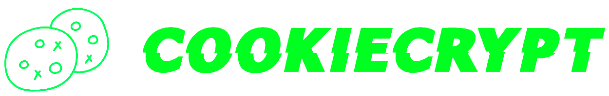

## Overview
CookieCrypt is an innovative browser extension designed to empower users with advanced cookie management. It offers a trio of key features: Cookie Inventory Categorization, Real-Time Cookie Monitoring & Alerts, and Cookie Permission Management. These functionalities enhance user understanding, provide greater control over privacy, and align with stringent data protection regulations. Behind its user-centric interface, CookieCrypt leverages a robust backend hosted on an Azure Cloud VM, utilizing Flask for a streamlined API endpoint. This backend is the powerhouse for processing cookies, employing multiple machine learning algorithms to ensure accuracy and efficiency in categorization. The use of Azure Cloud VM ensures scalability and reliability, allowing CookieCrypt to handle vast amounts of data seamlessly while providing the machine learning backbone necessary for its features.

  

## Key Features

### 1. Cookie Inventory Categorization
Utilizing machine learning algorithms, CookieCrypt automatically categorizes cookies into groups such as Necessary, Analytics, Functional, Others, and Advertisement. This categorization enriches user comprehension of cookies, promotes informed decision-making, and maintains alignment with GDPR for transparent communication about cookie usage.

#### Benefits:
- **Enhanced Understanding**: Provides an organized view of cookies, facilitating user education about their purpose.
- **Informed Decisions**: Empowers users with the knowledge to manage their privacy preferences effectively.
- **Regulatory Compliance**: Ensures that users are informed about cookie functions, in line with GDPR requirements.

### 2. Real-Time Cookie Monitoring & Alerts
CookieCrypt monitors cookies in real-time and alerts users about new cookie activity. This instant notification system heightens user awareness regarding site tracking and data collection practices, crucial for modern digital navigation.

#### Benefits:
- **Increased Awareness**: Alerts keep users informed of new cookies, enhancing transparency.
- **Privacy Protection**: Users can identify and prevent unauthorized tracking from unrecognized sources.
- **Control**: Offers immediate insights into site behaviors, allowing users to manage their digital footprint proactively.

### 3. Cookie Permission Management
The extension enables users to manage cookie permissions with ease, ensuring that their browsing experience aligns with their privacy expectations.

#### Benefits:
- **Autonomy Over Data**: Users can decide which cookies to accept or blacklist, giving them full control over their browsing experience.

## Installation
1. Download the `CookieCrypt` folder in this repository
2. On Google Chrome, go to `chrome://extensions/`
3. Enable 'Developer Mode'.
4. Choose 'Load Unpacked' and select the downloaded `CookieCrypt` folder

## Acknowledgements
Thank you Prof. Weihan and Prof. Liming for providing us with an opportunity to work on this Web Security project.
